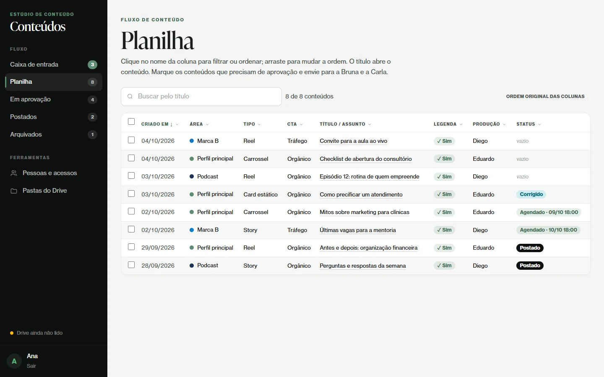
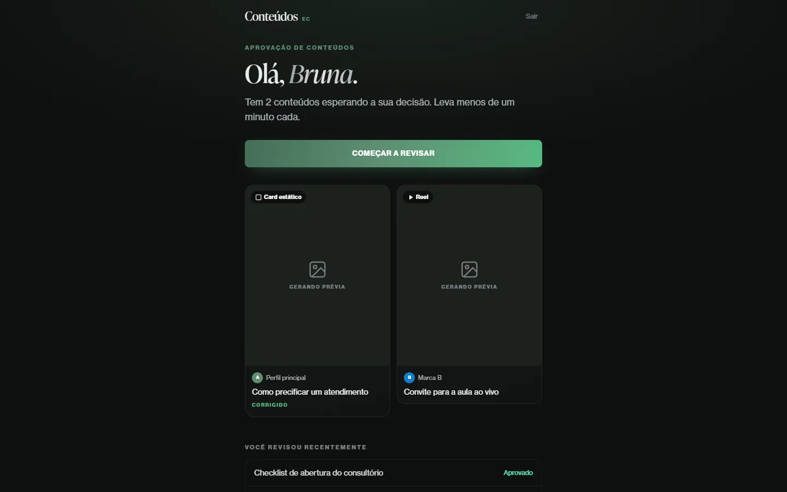
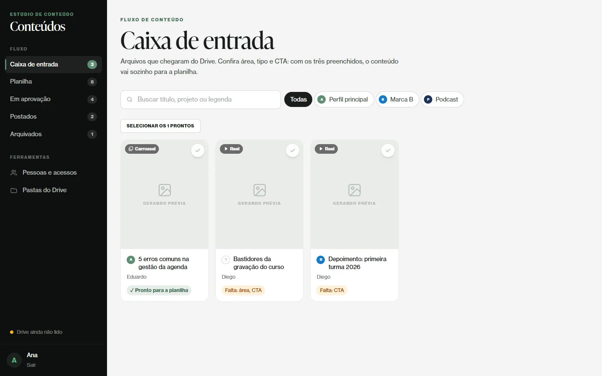

# content-workflow

**A content approval workflow for a social media team.** Videographers and designers drop finished files into Google Drive; this app catalogs them automatically, lets the content lead fill in the details in a spreadsheet-like view, and sends what needs sign-off to the approvers — who review independently, in any order, from a phone-friendly hub.

> 🇧🇷 Fluxo de aprovação de conteúdo para Instagram: cataloga os arquivos finalizados no Google Drive, organiza legendas e status numa planilha e coleta a aprovação das revisoras. Interface em português.

| Planilha (content lead) | Approval hub (reviewer) |
|---|---|
|  |  |



*Screenshots use fictional people and content.*

## What it does

- **Drive sync, no manual uploads.** A service account watches chosen Drive folders. The first sync records a *baseline* (what already existed never becomes content); after that, the Changes API picks up new and edited files every five minutes, and a nightly reconcile catches anything missed.
- **Rules instead of data entry.** `config/conteudo.php` decides what becomes content and pre-fills fields from folder and file names: raw footage, project files and "old version" folders are ignored; a folder of images becomes one **carousel**; account, CTA (organic / paid traffic) and who produced it are suggested from the path or the file owner.
- **Corrections are detected.** A new file whose name resembles a piece waiting for changes in the same folder is suggested as its correction, and replacing the Drive file marks it *corrigido*.
- **Inbox → Planilha.** Once account, type and CTA are filled in, a piece leaves the inbox for the *planilha*: sortable, filterable, reorderable columns, inline status (blank, corrected, scheduled, posted) and bulk actions.
- **Opt-in, independent approvals.** The lead chooses what needs approval. Each approver's decision is her latest review in the current round; approvals can happen in any order; a rejected piece can be reset to zero while keeping its history.
- **Passwordless access.** Each person gets a personal login link (`users:link`), sent over WhatsApp; tokens are stored hashed (plus encrypted, so the link can be shown again).
- **Fast previews.** Videos and images are cached locally (queued jobs) so reviewers can watch them without a Google login.

## How it's built

```
app/Services/ContentWorkflow.php   every status change goes through here (one place for the rules)
app/Services/Drive/DriveSync.php   baseline, incremental changes, reconcile, backfill
app/Services/Drive/ContentRules.php what becomes content and which fields are pre-filled
app/Services/Drive/DriveApi.php     interface; GoogleDrive.php talks to the real API
tests/Fakes/FakeDrive.php           in-memory Drive used by the test suite
```

**51 feature tests** cover the sync rules, the workflow and the screens. They run against `FakeDrive`, so no network or Google account is needed:

```bash
php artisan test
```

Scheduled work (`routes/console.php`): `drive:sync` every 5 minutes, `drive:reconcile` nightly, cache purge, and the queue worker — designed to run on shared hosting with a single cron entry (`schedule:run`).

## Run it locally

```bash
composer install && npm install && npm run build
cp .env.example .env && php artisan key:generate
touch database/database.sqlite && php artisan migrate --seed
php artisan users:link Ana          # prints a login link
php artisan serve
```

To sync a real Drive, create a Google Cloud service account, save its JSON key at the path in `GOOGLE_SERVICE_ACCOUNT_JSON`, share the folders with it, and run `php artisan drive:watch <folder link or id> --account=principal`.

## Stack

Laravel 13 · PHP 8.3 · Blade · Tailwind CSS 4 · Alpine.js · SQLite · Google Drive API · queues & scheduler

---

Built by [João Barbosa](https://joaobarbosa.pages.dev) at his employer and published here **with the employer's permission**. People, accounts, e-mail addresses, Drive folders and branding were replaced with fictional ones.

**© João Barbosa. All rights reserved.** No open-source license is granted — you're welcome to read the code, but please don't reuse it without permission.
